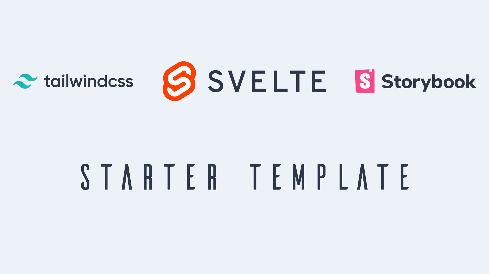

# A starter template for Svelte, TailwindCSS and Storybook




> starter from: [Svelte + TailwindCSS + Storybook](https://github.com/jerriclynsjohn/svelte-storybook-tailwind)

```bash
// Quickstart

npx degit HyuArzani/svelte-starter my-svelte-project
cd my-svelte-project

git init // avoid husky error
yarn
yarn dev
yarn stories
```

## Svelte + TailwindCSS + Storybook

[Storybook](https://storybook.js.org/) is an open source tool for developing JavaScript UI
components in isolation

[Svelte](https://svelte.dev/) is a component framework that allows you to write highly-efficient,
imperative code, that surgically updates the DOM to maintain performance.

[TailwindCSS](https://tailwindcss.com) is a highly customizable, low-level CSS framework that gives
you all of the building blocks you need to build bespoke designs without any annoying opinionated
styles you have to fight to override.

## TODO List for used in big project
- [x] Pre Commit Hooks
- [ ] Test Framework
- [ ] SSR Support
- [ ] PWA Support


## License
[](https://app.fossa.io/projects/git%2Bgithub.com%2Fjerriclynsjohn%2Fsvelte-storybook-tailwind?ref=badge_large)
